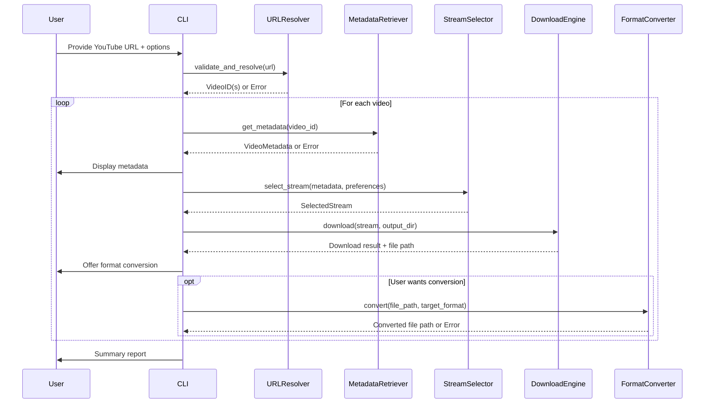
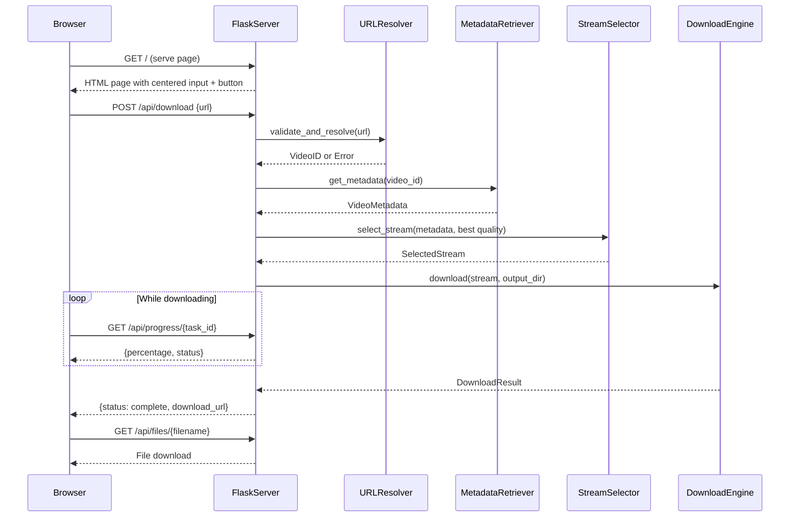

# Design Document

## Overview

This design describes a Python-based CLI application for downloading YouTube videos. The system wraps `yt-dlp` (the actively maintained fork of youtube-dl) for video resolution and downloading, and `ffmpeg` (via subprocess) for format conversion. The architecture follows a modular pipeline: URL validation → metadata retrieval → stream selection → download with progress → optional format conversion.

The system is built as a set of loosely coupled components communicating through well-defined data models. Each component has a single responsibility, making the system testable and extensible.

### Key Design Decisions

1. **yt-dlp as the extraction backend**: yt-dlp handles YouTube's constantly changing internals (cipher decryption, throttle avoidance, format negotiation). Building this from scratch would be fragile and maintenance-heavy.
2. **ffmpeg for format conversion**: ffmpeg is the industry standard for media transcoding. We invoke it via subprocess rather than a Python wrapper to minimize dependencies and maximize compatibility.
3. **Python CLI with no GUI**: Keeps the scope focused. A GUI or web frontend can be layered on top of the same core modules later.
4. **Flask for the web UI**: A lightweight Flask server serves a single-page web interface. The frontend is plain HTML/CSS/JS with no build step, keeping the stack minimal. The backend exposes a small REST API that reuses the existing core modules.
5. **Structured logging with Python's `logging` module**: All operations log to both console and a rotating log file.
6. **Resume via HTTP Range headers**: yt-dlp natively supports resumable downloads. We configure it to retain partial files and resume on retry.

## Architecture

```mermaid
graph TD
    CLI[CLI Entry Point] --> URLResolver[URL Resolver]
    WebUI[Web UI - Flask Server] --> URLResolver
    URLResolver --> MetadataRetriever[Metadata Retriever]
    MetadataRetriever --> StreamSelector[Stream Selector]
    StreamSelector --> DownloadEngine[Download Engine]
    DownloadEngine --> FormatConverter[Format Converter]
    DownloadEngine --> ProgressReporter[Progress Reporter]

    WebUI -->|serves| StaticPage[HTML/CSS/JS Page]
    WebUI -->|REST API| DownloadAPI[/api/download]
    WebUI -->|REST API| ProgressAPI[/api/progress]

    URLResolver -->|validates & extracts| VideoID[Video/Playlist IDs]
    MetadataRetriever -->|fetches via yt-dlp| VideoMetadata[Video Metadata]
    StreamSelector -->|filters & sorts| SelectedStream[Selected Stream]
    DownloadEngine -->|downloads file| OutputFile[Output File]
    FormatConverter -->|converts via ffmpeg| ConvertedFile[Converted File]
```

### Component Interaction Flow



### Web UI Interaction Flow



## Components and Interfaces

### 1. URL Resolver

Validates YouTube URLs and extracts video/playlist identifiers.

```python
class URLResolver:
    """Validates and resolves YouTube URLs into video identifiers."""

    YOUTUBE_URL_PATTERNS: list[re.Pattern]  # Compiled regex patterns for valid YouTube URLs

    def validate_and_resolve(self, url: str) -> ResolvedURL:
        """
        Validate a YouTube URL and extract video/playlist identifiers.

        Args:
            url: Raw URL string from user input.

        Returns:
            ResolvedURL with video_ids and url_type (single/playlist).

        Raises:
            InvalidURLError: URL does not match any recognized YouTube format.
            VideoUnavailableError: Video is private, deleted, or region-locked.
        """
        ...
```

### 2. Metadata Retriever

Fetches video metadata using yt-dlp's extraction API.

```python
class MetadataRetriever:
    """Retrieves video metadata from YouTube via yt-dlp."""

    def __init__(self, max_retries: int = 3, backoff_base: float = 1.0):
        ...

    def get_metadata(self, video_id: str) -> VideoMetadata:
        """
        Fetch metadata for a single video.

        Args:
            video_id: YouTube video identifier.

        Returns:
            VideoMetadata including title, duration, streams, etc.

        Raises:
            NetworkError: After max_retries with exponential backoff.
            VideoUnavailableError: Video cannot be accessed.
        """
        ...
```

### 3. Stream Selector

Filters and sorts available streams based on user preferences.

```python
class StreamSelector:
    """Selects the best matching stream based on user preferences."""

    SUPPORTED_FORMATS: set[str] = {"mp4", "webm", "mp3"}

    def select_stream(
        self,
        metadata: VideoMetadata,
        preferred_resolution: int | None = None,
        preferred_format: str | None = None,
        audio_only: bool = False,
    ) -> Stream:
        """
        Select the best matching stream from available options.

        Args:
            metadata: Video metadata containing available streams.
            preferred_resolution: Max resolution in pixels (e.g., 1080). Selects closest <= value.
            preferred_format: Desired container format.
            audio_only: If True, only consider audio streams.

        Returns:
            The best matching Stream.

        Raises:
            NoMatchingStreamError: No stream matches the given criteria.
        """
        ...

    def list_streams(
        self,
        metadata: VideoMetadata,
        audio_only: bool = False,
    ) -> list[Stream]:
        """
        Return available streams sorted by resolution (desc) or bitrate (desc for audio).

        Args:
            metadata: Video metadata containing available streams.
            audio_only: If True, return only audio streams sorted by bitrate.

        Returns:
            Sorted list of Stream objects.
        """
        ...
```

### 4. Download Engine

Handles file download with progress tracking and resume capability.

```python
class DownloadEngine:
    """Downloads video/audio streams with progress tracking and resume support."""

    def __init__(self, progress_callback: Callable[[DownloadProgress], None] | None = None):
        ...

    def download(
        self,
        stream: Stream,
        output_dir: str,
        filename: str,
        on_conflict: ConflictResolution = ConflictResolution.ASK,
    ) -> DownloadResult:
        """
        Download a stream to the specified directory.

        Args:
            stream: The stream to download.
            output_dir: Target directory (created if missing).
            filename: Sanitized filename (without extension).
            on_conflict: How to handle existing files (OVERWRITE, RENAME, CANCEL, ASK).

        Returns:
            DownloadResult with file_path, success status, and any error info.

        Raises:
            DiskSpaceError: Insufficient disk space, includes required_bytes.
            NetworkError: After retry exhaustion.
        """
        ...

    def resume_download(self, partial_file_path: str, stream: Stream) -> DownloadResult:
        """
        Resume a previously interrupted download.

        Args:
            partial_file_path: Path to the partial .part file.
            stream: The original stream metadata.

        Returns:
            DownloadResult with final file path and status.
        """
        ...
```

### 5. Format Converter

Converts downloaded files to different formats using ffmpeg.

```python
class FormatConverter:
    """Converts media files between formats using ffmpeg."""

    SUPPORTED_FORMATS: set[str] = {"mp4", "mkv", "avi", "mp3", "wav"}

    def convert(
        self,
        input_path: str,
        target_format: str,
        progress_callback: Callable[[float], None] | None = None,
    ) -> ConversionResult:
        """
        Convert a media file to the target format.

        Args:
            input_path: Path to the source file.
            target_format: Target container format (e.g., "mkv").
            progress_callback: Called with percentage (0.0-100.0) during conversion.

        Returns:
            ConversionResult with output_path and success status.
            Original file is always retained on failure.

        Raises:
            ConversionError: ffmpeg process failed.
            UnsupportedFormatError: Target format not in SUPPORTED_FORMATS.
        """
        ...
```

### 6. Progress Reporter

Unified progress reporting for downloads and conversions.

```python
class ProgressReporter:
    """Reports progress for downloads and playlist operations."""

    def report_download_progress(self, progress: DownloadProgress) -> None:
        """Display download progress to the console (throttled to ≤1s intervals)."""
        ...

    def report_playlist_progress(self, current_index: int, total: int, video_title: str) -> None:
        """Display playlist-level progress."""
        ...

    def report_conversion_progress(self, percentage: float) -> None:
        """Display format conversion progress."""
        ...
```

### 7. Web UI (Flask Application)

Serves a minimal, Google-search-style web page and exposes a REST API for downloads.

```python
# web_app.py
from flask import Flask, render_template, request, jsonify, send_from_directory
import threading
import uuid

app = Flask(__name__, template_folder="templates", static_folder="static")

# In-memory task store for tracking download progress
download_tasks: dict[str, dict] = {}


@app.route("/")
def index() -> str:
    """Serve the main page with centered URL input and download button."""
    ...


@app.route("/api/download", methods=["POST"])
def start_download() -> tuple[dict, int]:
    """
    Start a video download.

    Request body: {"url": "<youtube_url>"}

    Returns:
        201: {"task_id": "<uuid>", "title": "<video_title>"}
        400: {"error": "<validation error message>"}
        500: {"error": "<download error message>"}

    The download runs in a background thread. Poll /api/progress/<task_id> for status.
    """
    ...


@app.route("/api/progress/<task_id>")
def get_progress(task_id: str) -> tuple[dict, int]:
    """
    Get download progress for a task.

    Returns:
        200: {"status": "downloading"|"complete"|"error", "percentage": float,
              "download_url": str|null, "error": str|null}
        404: {"error": "Task not found"}
    """
    ...


@app.route("/api/files/<filename>")
def serve_file(filename: str) -> Response:
    """Serve a downloaded file for the user to save."""
    ...


def run_server(port: int = 5000, output_dir: str = "./downloads") -> None:
    """Start the Flask development server."""
    ...
```

#### HTML Template (`templates/index.html`)

A single-page layout inspired by Google's search page:

- Full viewport height with vertical and horizontal centering via flexbox
- Application title/logo at the top of the centered content
- A wide input field (URL input, placeholder: "Paste YouTube URL here")
- A styled download button directly below the input
- A hidden results area that shows: progress bar during download, download link on success, error message on failure
- Clean, minimal styling with no external CSS frameworks

#### Static Assets (`static/style.css`, `static/app.js`)

- `style.css`: Minimal CSS for centering, input/button styling, progress bar, and error states
- `app.js`: Handles form submission via `fetch()`, polls `/api/progress/{task_id}`, updates the UI with progress/results/errors

## Data Models

```python
from dataclasses import dataclass, field
from enum import Enum
from datetime import datetime


class URLType(Enum):
    SINGLE = "single"
    PLAYLIST = "playlist"


class ConflictResolution(Enum):
    OVERWRITE = "overwrite"
    RENAME = "rename"
    CANCEL = "cancel"
    ASK = "ask"


@dataclass(frozen=True)
class ResolvedURL:
    """Result of URL validation and resolution."""
    video_ids: list[str]
    url_type: URLType
    playlist_title: str | None = None


@dataclass(frozen=True)
class Stream:
    """A single downloadable stream."""
    format_id: str
    url: str
    container: str          # "mp4", "webm", "mp3", etc.
    resolution: int | None  # Height in pixels (None for audio-only)
    bitrate: int            # In kbps
    codec: str
    file_size: int | None   # In bytes (None if unknown)
    is_audio_only: bool = False


@dataclass(frozen=True)
class VideoMetadata:
    """Metadata for a single YouTube video."""
    video_id: str
    title: str
    duration_seconds: int
    thumbnail_url: str
    upload_date: str        # ISO 8601 date string
    streams: list[Stream]


@dataclass
class DownloadProgress:
    """Current state of a download."""
    bytes_downloaded: int
    total_bytes: int | None
    speed_bytes_per_sec: float
    eta_seconds: float | None
    percentage: float       # 0.0 to 100.0


@dataclass(frozen=True)
class DownloadResult:
    """Result of a download operation."""
    success: bool
    file_path: str | None
    error_message: str | None = None
    was_resumed: bool = False


@dataclass(frozen=True)
class ConversionResult:
    """Result of a format conversion."""
    success: bool
    output_path: str | None
    original_path: str
    error_message: str | None = None


@dataclass
class PlaylistDownloadSummary:
    """Summary of a playlist download operation."""
    total_videos: int
    successful: list[str]       # List of video titles
    failed: list[tuple[str, str]]  # List of (video_title, error_message)
```


## Correctness Properties

*A property is a characteristic or behavior that should hold true across all valid executions of a system — essentially, a formal statement about what the system should do. Properties serve as the bridge between human-readable specifications and machine-verifiable correctness guarantees.*

### Property 1: Valid YouTube URL extraction

*For any* valid YouTube URL (including standard watch URLs, short-form youtu.be URLs, and URLs with extra query parameters), the URL_Resolver SHALL extract the correct video identifier that matches the ID embedded in the URL.

**Validates: Requirements 1.1, 1.2**

### Property 2: Playlist URL identification and extraction

*For any* valid YouTube playlist URL, the URL_Resolver SHALL identify it as a playlist type and extract the correct playlist identifier.

**Validates: Requirements 1.3**

### Property 3: Invalid URL rejection

*For any* string that is not a valid YouTube URL (random text, URLs from other domains, malformed URLs), the URL_Resolver SHALL raise an InvalidURLError.

**Validates: Requirements 1.4**

### Property 4: Metadata extraction completeness

*For any* yt-dlp info dictionary containing video information and format lists, the metadata extraction SHALL produce a VideoMetadata object with non-null title, duration, thumbnail_url, upload_date, and a streams list where each Stream has resolution (or None for audio-only), bitrate, codec, and file_size populated.

**Validates: Requirements 2.1, 2.2**

### Property 5: Stream sorting by resolution

*For any* list of video streams, list_streams() SHALL return them sorted by resolution in descending order, such that for every consecutive pair (stream_i, stream_i+1), stream_i.resolution >= stream_i+1.resolution.

**Validates: Requirements 3.1**

### Property 6: Closest resolution selection without exceeding preferred value

*For any* list of streams and any preferred resolution value, select_stream() SHALL return a stream whose resolution is less than or equal to the preferred value, and no other available stream has a resolution that is both greater than the selected stream's resolution and less than or equal to the preferred value.

**Validates: Requirements 3.2, 3.3**

### Property 7: Audio-only stream filtering and sorting

*For any* list of streams containing both audio-only and video streams, list_streams(audio_only=True) SHALL return only streams where is_audio_only is True, sorted by bitrate in descending order.

**Validates: Requirements 3.5**

### Property 8: Filename sanitization produces valid filenames

*For any* video title string (including special characters, path separators, unicode, very long strings, and reserved OS filenames), the sanitization function SHALL produce a non-empty string that is a valid filename on the target OS and has the correct file extension appended.

**Validates: Requirements 4.3**

### Property 9: Download integrity verification

*For any* expected file size from Stream metadata and any actual downloaded file size, the integrity check SHALL pass if and only if the two sizes are equal.

**Validates: Requirements 5.4**

### Property 10: Playlist download summary accuracy

*For any* combination of successful and failed video downloads in a playlist, the PlaylistDownloadSummary SHALL have total_videos equal to the sum of successful and failed counts, the successful list SHALL contain exactly the titles of videos that downloaded successfully, and the failed list SHALL contain exactly the titles and error messages of videos that failed.

**Validates: Requirements 6.3, 6.5**

### Property 11: Web UI download API round-trip

*For any* valid YouTube URL submitted to the `/api/download` endpoint, the API SHALL return a task_id, and polling `/api/progress/{task_id}` SHALL eventually return a status of either "complete" with a non-null download_url, or "error" with a non-null error message.

**Validates: Requirements 9.3, 9.4, 9.5, 9.6**

### Property 12: Web UI invalid URL error response

*For any* invalid URL submitted to the `/api/download` endpoint, the API SHALL return a 400 status code with a descriptive error message.

**Validates: Requirements 9.6**

## Error Handling

### Error Hierarchy

```python
class DownloaderError(Exception):
    """Base exception for all downloader errors."""
    pass

class InvalidURLError(DownloaderError):
    """URL is not a recognized YouTube format."""
    pass

class VideoUnavailableError(DownloaderError):
    """Video is private, deleted, or region-locked."""
    reason: str  # "private", "deleted", "region_locked", "unknown"

class NetworkError(DownloaderError):
    """Network operation failed after retries."""
    attempts: int

class NoMatchingStreamError(DownloaderError):
    """No stream matches the given selection criteria."""
    pass

class DiskSpaceError(DownloaderError):
    """Insufficient disk space."""
    required_bytes: int
    available_bytes: int

class ConversionError(DownloaderError):
    """ffmpeg conversion failed."""
    ffmpeg_stderr: str
    original_file_path: str  # Always retained

class UnsupportedFormatError(DownloaderError):
    """Requested format is not supported."""
    requested_format: str
    supported_formats: set[str]
```

### Retry Strategy

All network operations use a shared retry decorator:

- **Max retries**: 3
- **Backoff**: Exponential with base 1 second (1s, 2s, 4s)
- **Retryable errors**: Connection timeout, connection reset, HTTP 5xx
- **Non-retryable errors**: HTTP 4xx (except 429), invalid URL, video unavailable

### Error Recovery Behaviors

| Scenario | Behavior |
|---|---|
| Invalid URL | Immediate error with format guidance |
| Video unavailable | Immediate error with reason (private/deleted/region-locked) |
| Network timeout | Retry up to 3 times with exponential backoff |
| Disk full | Pause download, notify user with required space |
| Partial download exists | Resume from last byte on retry |
| Remote file changed | Discard partial, restart from beginning |
| Conversion failure | Retain original file, report ffmpeg error |
| Playlist video failure | Log error, skip video, continue with rest |

### Logging

All operations are logged using Python's `logging` module:

- **Log file**: `youtube_downloader.log` in the output directory (rotating, max 5MB, 3 backups)
- **Format**: `%(asctime)s - %(name)s - %(levelname)s - %(message)s`
- **Levels**: DEBUG for internal operations, INFO for user-visible actions, WARNING for retries, ERROR for failures

## Testing Strategy

### Unit Tests

Unit tests cover specific examples, edge cases, and error conditions using `pytest`:

- **URL Resolver**: Test specific URL formats (standard, short, playlist, with timestamps, with extra params), specific invalid inputs (empty string, non-URL text, other-site URLs)
- **Metadata Retriever**: Test retry behavior (mock 3 failures then success, mock 4 failures for error), test exponential backoff timing
- **Stream Selector**: Test format support smoke check (mp4, webm, mp3 in SUPPORTED_FORMATS), test empty stream list handling, test no-match scenarios
- **Download Engine**: Test directory creation, test conflict resolution (overwrite/rename/cancel), test progress callback intervals
- **Format Converter**: Test supported format smoke check (mp4, mkv, avi, mp3, wav), test conversion failure retains original file, test progress percentage bounds
- **Playlist**: Test sequential download order, test skip-on-failure behavior, test summary display
- **Web UI**: Test Flask routes return correct status codes, test `/api/download` with valid/invalid URLs, test `/api/progress` with known/unknown task IDs, test static file serving

### Property-Based Tests

Property-based tests use `hypothesis` (Python) with a minimum of 100 iterations per property. Each test is tagged with its design property reference.

| Property | Test Description | Generator Strategy |
|---|---|---|
| Property 1 | Valid URL extraction | Generate random video IDs (11 alphanumeric chars), embed in random valid URL templates (watch?v=, youtu.be/, embed/, shorts/) with random query params |
| Property 2 | Playlist URL identification | Generate random playlist IDs, embed in playlist URL templates with varying params |
| Property 3 | Invalid URL rejection | Generate random strings, non-YouTube domain URLs, malformed URLs |
| Property 4 | Metadata extraction completeness | Generate random yt-dlp info dicts with varying fields and format lists |
| Property 5 | Stream sorting by resolution | Generate random lists of Stream objects with random resolutions |
| Property 6 | Closest resolution selection | Generate random stream lists + random preferred resolution integers |
| Property 7 | Audio-only filtering and sorting | Generate mixed lists of audio-only and video Stream objects |
| Property 8 | Filename sanitization | Generate random strings with special chars, unicode, path separators, OS-reserved names, very long strings |
| Property 9 | Download integrity verification | Generate random pairs of (expected_size, actual_size) integers |
| Property 10 | Playlist summary accuracy | Generate random lists of (title, success/failure) tuples |
| Property 11 | Web UI download API round-trip | Generate valid YouTube URLs, submit to test client, poll progress until terminal state |
| Property 12 | Web UI invalid URL error response | Generate random invalid strings, submit to test client, assert 400 response |

**Tag format**: `# Feature: youtube-video-downloader, Property {N}: {title}`

### Integration Tests

Integration tests verify end-to-end behavior with mocked external services:

- **Video unavailability** (Req 1.5): Mock yt-dlp returning private/deleted/region-locked errors
- **Download resume** (Req 5.1, 5.2, 5.3): Mock interrupted downloads, verify resume from correct byte position, verify stale file detection
- **Disk space handling** (Req 7.4): Mock disk full errors, verify pause and notification
- **Playlist error resilience** (Req 6.4): Mock playlist with one failing video, verify skip and continue
- **Format conversion** (Req 8.1-8.4): Mock ffmpeg subprocess, verify conversion flow and error handling
- **Web UI end-to-end** (Req 9.3-9.6): Use Flask test client to submit a URL, poll progress, verify download link or error response

### Test Dependencies

- `pytest` — test runner
- `hypothesis` — property-based testing
- `pytest-mock` / `unittest.mock` — mocking yt-dlp and ffmpeg
- `pytest-cov` — coverage reporting
- `flask` — web UI framework (also used via `app.test_client()` in tests)
